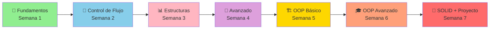

# 🐍 Python Crash Course - Google Automation

[](https://www.python.org/)
[](LICENSE)
[](docs/)

Repositorio completo de un curso intensivo de Python, desde conceptos básicos hasta programación orientada a objetos avanzada y principios SOLID. Incluye 33 lecciones progresivas y desafíos prácticos enfocados en Cloud/DevOps.

---

## 📖 Documentación Completa

Toda la documentación del curso está disponible en la carpeta [`docs/`](docs/):

### 🎯 [Guía Principal de Documentación](docs/README.md)

Comienza aquí para ver el índice completo y la ruta de aprendizaje recomendada.

---

## 📚 Contenido del Curso

### 📊 Progresión del Curso



### 🌟 Fundamentos (Semana 1)
- **[Lección 1-3](docs/01-fundamentos.md#hello-world)**: Hello World, Input/Output
- **[Lección 4-5](docs/02-control-flujo.md#bucles-for)**: Bucles For Básicos
- **[Lección 6-7](docs/01-fundamentos.md#conversiones)**: Conversiones Explícitas
- **[Lección 8](docs/02-control-flujo.md#funciones)**: Funciones

### 🔄 Control de Flujo (Semana 2)
- **[Lección 9-10](docs/02-control-flujo.md#condicionales)**: Condicionales If/Elif/Else
- **[Lección 11](docs/02-control-flujo.md#for-avanzado)**: Bucles For Avanzados
- **[Lección 12](docs/02-control-flujo.md#while)**: Bucles While
- **[Lección 13](docs/02-control-flujo.md#bucles-anidados)**: Bucles Anidados
- **[Lección 14](docs/02-control-flujo.md#recursion)**: Recursión

### 📊 Estructuras de Datos (Semana 3)
- **[Lección 15](docs/03-estructuras-datos.md#tipos-de-datos)**: Tipos de Datos y Strings
- **[Lección 16](docs/03-estructuras-datos.md#listas)**: Listas y Métodos
- **[Lección 17](docs/03-estructuras-datos.md#tuplas)**: Tuplas y Enumerate
- **[Lección 18](docs/03-estructuras-datos.md#comprension)**: List Comprehension
- **[Lección 19](docs/03-estructuras-datos.md#diccionarios)**: Diccionarios
- **[Lección 20](docs/03-estructuras-datos.md#generadores)**: Generadores
- **[Lección 23](docs/03-estructuras-datos.md#sets-conjuntos)**: Sets (Conjuntos)

### 🚀 Conceptos Avanzados (Semana 4)
- **[Lección 21](docs/04-avanzado.md#decoradores)**: Decoradores
- **[Lección 22](docs/04-avanzado.md#recursion-avanzada)**: Recursión Avanzada
- **[Lección 24](docs/04-avanzado.md#string-methods)**: Métodos de Strings

### 🏗️ OOP Básico (Semana 5)
- **[Lección 25](docs/05-oop-basico.md#introduccion)**: Introducción a OOP
- **[Lección 26](docs/05-oop-basico.md#herencia)**: Herencia

### 🎓 OOP Avanzado (Semana 6)
- **[Lección 27](docs/06-oop-avanzado.md#mro)**: Method Resolution Order (MRO)
- **[Lección 28](docs/06-oop-avanzado.md#polimorfismo)**: Polimorfismo
- **[Lección 29](docs/06-oop-avanzado.md#encapsulacion)**: Encapsulación
- **[Lección 30](docs/06-oop-avanzado.md#abstraccion)**: Abstracción
- **[Lección 31](docs/06-oop-avanzado.md#metodos-especiales)**: Métodos Especiales

### 🎯 Principios y Proyectos (Semana 7)
- **[Lección 32](docs/07-solid.md)**: Principios SOLID
- **[Lección 33](docs/08-proyecto-final.md)**: Proyecto Final - Analizador de Sentimientos

### 💼 Desafíos Prácticos
- **[Challenges Cloud/DevOps](docs/09-challenges.md)**: 5 desafíos prácticos

---

## 🗂️ Estructura del Repositorio

```
python_crash_course_coursera/
├── docs/                          # 📚 Documentación completa
│   ├── README.md                  # Índice principal
│   ├── 01-fundamentos.md
│   ├── 02-control-flujo.md
│   ├── 03-estructuras-datos.md
│   ├── 04-avanzado.md
│   ├── 05-oop-basico.md
│   ├── 06-oop-avanzado.md
│   ├── 07-solid.md
│   ├── 08-proyecto-final.md
│   └── 09-challenges.md
├── Lessons/                       # 📝 33 lecciones de código
│   ├── 1_st_hello_world.py
│   ├── 2_nd_input.py
│   ├── ...
│   ├── 23_rd_Sets.py
│   └── 33rd_Final_Excercise.py
├── Challenges/                    # 💼 Desafíos prácticos
│   ├── 1stChallenge.py
│   ├── 2ndChallenge.py
│   ├── ...
│   └── Terraform.tf
└── README.md                      # Este archivo
```

---

## 🚀 Inicio Rápido

### 1. Clona el Repositorio

```bash
git clone https://github.com/scaag92/python_crash_course_coursera.git
cd python_crash_course_coursera
```

### 2. Lee la Documentación

Comienza con la [Guía Principal](docs/README.md) para ver el plan de estudios completo.

### 3. Ejecuta las Lecciones

```bash
# Ejemplo: Ejecutar la primera lección
python Lessons/1_st_hello_world.py

# Ejemplo: Ejecutar un desafío
python Challenges/1stChallenge.py
```

### 4. Instala Dependencias (Proyecto Final)

```bash
pip install textblob openai python-dotenv
```

---

## 🎯 Rutas de Aprendizaje

### 👶 Principiante
1. Comienza con [Fundamentos](docs/01-fundamentos.md)
2. Continúa con [Control de Flujo](docs/02-control-flujo.md)
3. Practica con las primeras 10 lecciones

### 🧑‍💻 Intermedio
1. Revisa [Estructuras de Datos](docs/03-estructuras-datos.md)
2. Explora [Conceptos Avanzados](docs/04-avanzado.md)
3. Practica con las lecciones 11-23

### 🚀 Avanzado
1. Domina [OOP Básico](docs/05-oop-basico.md) y [OOP Avanzado](docs/06-oop-avanzado.md)
2. Aplica [Principios SOLID](docs/07-solid.md)
3. Completa el [Proyecto Final](docs/08-proyecto-final.md)
4. Resuelve los [Desafíos](docs/09-challenges.md)

---

## 📋 Requisitos

- Python 3.8 o superior
- Editor de código (VS Code, PyCharm, etc.)
- Terminal/Consola

### Dependencias Opcionales

```bash
# Para el proyecto final
pip install textblob openai

# Para desarrollo
pip install pytest black flake8
```

---

## 🎓 Certificación

Este curso está basado en el programa de Google IT Automation with Python de Coursera.

---

## 🤝 Contribuciones

Las contribuciones son bienvenidas! Si encuentras errores o quieres mejorar el contenido:

1. Fork el repositorio
2. Crea una rama (`git checkout -b feature/mejora`)
3. Commit tus cambios (`git commit -am 'Agrega nueva funcionalidad'`)
4. Push a la rama (`git push origin feature/mejora`)
5. Abre un Pull Request

---

## 📝 Licencia

Este proyecto está bajo la Licencia MIT. Ver el archivo `LICENSE` para más detalles.

---

## 📧 Contacto

- **Autor**: Cristian Arias
- **Email**: scaag92@gmail.com
- **GitHub**: [@scaag92](https://github.com/scaag92)

---

## 🌟 Agradecimientos

- Google IT Automation with Python (Coursera)
- Comunidad de Python
- Todos los contribuidores

---

## 📊 Progreso del Curso

- [x] Fundamentos (Lecciones 1-8)
- [x] Control de Flujo (Lecciones 9-14)
- [x] Estructuras de Datos (Lecciones 15-20)
- [x] Conceptos Avanzados (Lecciones 21-23)
- [x] OOP (Lecciones 24-30)
- [x] SOLID (Lección 31)
- [x] Proyecto Final (Lección 32)
- [x] Desafíos Prácticos

---

**¡Feliz aprendizaje! 🎉**
