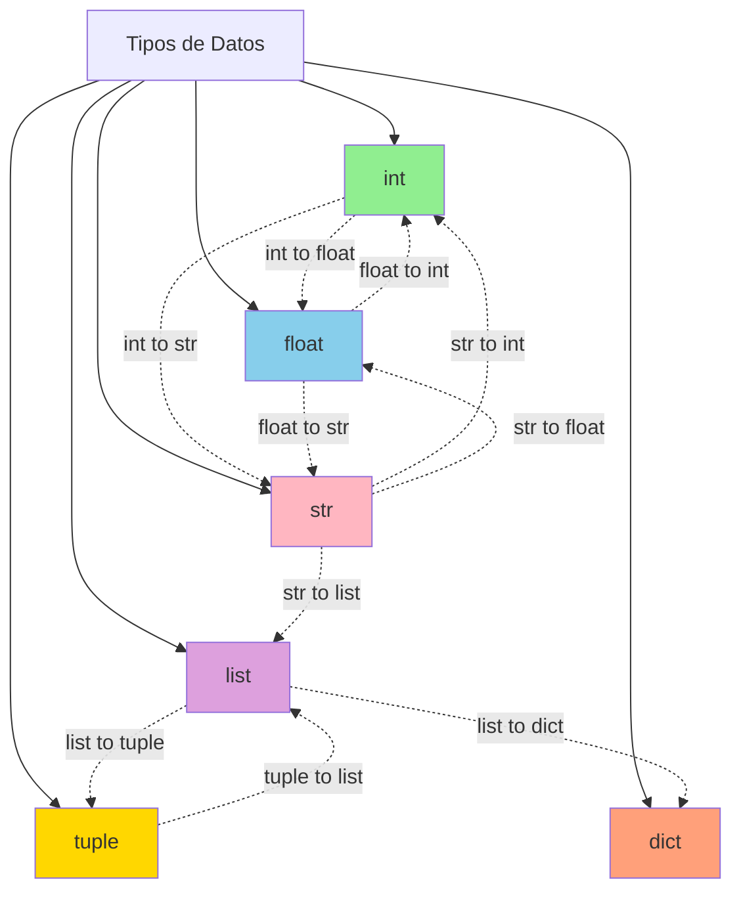

# 🎯 Fundamentos de Python

## Flujo de Aprendizaje


## Hello World

### Lección 1: Primeros Pasos

El primer programa en Python es tradicionalmente "Hello World". Python hace esto increíblemente simple.

```python
print("Hello World")
```

### Conceptos Básicos

#### Operaciones Aritméticas
```python
print(125 + 125)  # Suma: 250
```

#### Variables y Tipos de Datos
```python
n = 22
print(type(n), n)  # <class 'int'> 22

f = float(n)
print(type(f), f)  # <class 'float'> 22.0
```

#### Concatenación de Strings
```python
print("Hello " + "World ")  # Hello World
print("Hello \n" * 3)  # Imprime "Hello" 3 veces en líneas separadas
```

#### Formato de Salida
```python
print("You're number is: ", 3)  # You're number is: 3
```

💡 **Tip**: Python es un lenguaje de tipado dinámico, no necesitas declarar el tipo de variable explícitamente.

---

## Input

### Lección 2-3: Manejo de Entrada del Usuario

Python proporciona la función `input()` para recibir datos del usuario.

#### Input Básico
```python
n = input()
print(n)
```

#### Input con Mensaje
```python
f = input("Write a number: ")
print(f)
```

#### Ejemplo Completo
```python
print('Enter your name:')
x = input()
print('Hello, ' + x)
```

⚠️ **Advertencia**: `input()` siempre devuelve un string. Si necesitas un número, debes convertirlo:

```python
age = int(input("Enter your age: "))
```

---

## Conversiones

### Lección 6-7: Conversiones Explícitas de Tipo

La conversión explícita (type casting) es el proceso de convertir un tipo de dato a otro.

#### Diagrama de Conversiones



#### Tabla de Conversiones

```
┌──────────────────────────────────────────────┐
│         CONVERSIONES DE TIPOS                │
├──────────┬───────────┬───────────────────────┤
│  Desde   │   Hacia   │      Función          │
├──────────┼───────────┼───────────────────────┤
│  float   │    int    │  int(3.14) → 3        │
│  str     │    int    │  int("10") → 10       │
│  int     │   float   │  float(5) → 5.0       │
│  str     │   float   │  float("3.14") → 3.14 │
│  int     │    str    │  str(10) → "10"       │
│  list    │   tuple   │  tuple([1,2]) → (1,2) │
│  tuple   │   list    │  list((1,2)) → [1,2]  │
│  str     │   list    │  list("hi") → ['h','i']│
└──────────┴───────────┴───────────────────────┘
```

#### Conversión a Integer
```python
num_float = 3.14
num_str = "10"

int_from_float = int(num_float)  # 3
int_from_str = int(num_str)      # 10
```

#### Conversión a Float
```python
num_str = "3.14"
num_int = 5

float_from_str = float(num_str)  # 3.14
float_from_int = float(num_int)  # 5.0
```

#### Conversión a String
```python
num = 10
boolean = True

str_from_num = str(num)      # "10"
str_from_bool = str(boolean) # "True"
```

#### Ejemplo Práctico
```python
total = 2048 + 4357 + 97658 + 125 + 8
files = 5
average = total / files
print("The average size is: " + str(average))
```

#### Conversión a Lista
```python
tuple_data = (1, 2, 3)
str_data = "hello"

list_from_tuple = list(tuple_data)  # [1, 2, 3]
list_from_str = list(str_data)      # ['h', 'e', 'l', 'l', 'o']
```

#### Conversión a Tupla
```python
list_data = [1, 2, 3]
str_data = "hello"

tuple_from_list = tuple(list_data)  # (1, 2, 3)
tuple_from_str = tuple(str_data)    # ('h', 'e', 'l', 'l', 'o')
```

#### Conversión a Diccionario
```python
pair_list = [("a", 1), ("b", 2), ("c", 3)]
dict_from_pairs = dict(pair_list)  # {'a': 1, 'b': 2, 'c': 3}
```

### Notas Importantes sobre Conversiones

📌 **Manejo de Errores**: La conversión puede fallar si el valor no es compatible con el tipo objetivo, generando `ValueError` o `TypeError`.

📌 **Pérdida de Información**: Convertir de un tipo más preciso a uno menos preciso (como float a int) puede resultar en pérdida de información.

```python
pi = 3.14159
pi_int = int(pi)  # 3 (se pierde la parte decimal)
```

📌 **Tipos Inmutables**: Convertir tipos mutables (como listas) a tipos inmutables (como tuplas) crea un objeto completamente nuevo.

---

## Ejercicios Prácticos

### Ejercicio 1: Calculadora de Promedio
```python
numerator = int(input("Enter numerator: "))
denominator = int(input("Enter denominator: "))
result = numerator / denominator
print(result)
```

### Ejercicio 2: Información Personal
```python
name = input("Enter your name: ")
age = int(input("Enter your age: "))
print(f"Hello {name}, you are {age} years old")
```

---

## Resumen

En esta sección aprendiste:
- ✅ Cómo imprimir en consola con `print()`
- ✅ Cómo recibir entrada del usuario con `input()`
- ✅ Tipos de datos básicos (int, float, str)
- ✅ Conversiones explícitas entre tipos
- ✅ Operaciones aritméticas básicas
- ✅ Concatenación de strings

💡 **Siguiente paso**: Continúa con [Control de Flujo](./02-control-flujo.md) para aprender sobre funciones y condicionales.
