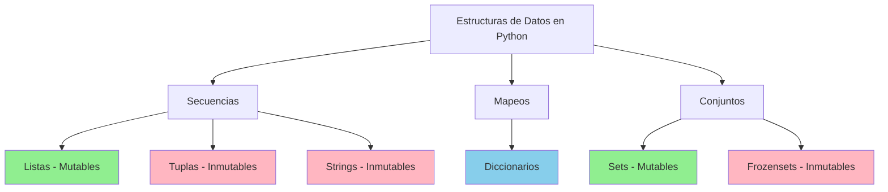
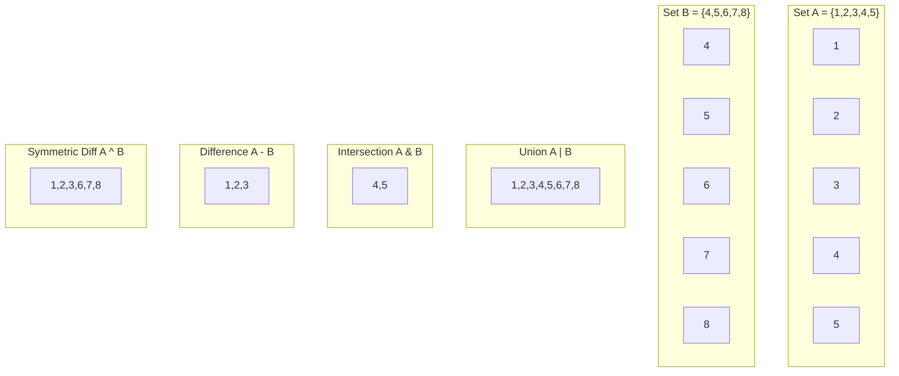

# 📊 Estructuras de Datos en Python

## Jerarquía de Estructuras de Datos



## Tipos de Datos

### Lección 15: Tipos de Datos y Operaciones con Strings

Python ofrece varios tipos de datos fundamentales y operaciones poderosas con strings.

#### Operaciones con Strings

```python
# Indexación
word = "casa"
print(word[0])  # 'c'

# Longitud
text = "Hello, World!"
length = len(text)
print(length)  # 13
```

#### Métodos de String Importantes

```python
# index() - Encuentra la posición de un carácter
word = "supercalifragilisticexpialidocious"
print(word.index('x'))  # 21

# split() - Divide un string en lista
sentence = "Hello World Python"
words = sentence.split()
print(words)  # ['Hello', 'World', 'Python']

# replace() - Reemplaza texto
text = "Hello World"
new_text = text.replace("World", "Python")
print(new_text)  # "Hello Python"
```

#### Formato de Strings

```python
name = "Manny"
number = len(name) * 3
print("Hello {}, Your lucky number is: {}".format(name, number))

# Con nombres
print("Hello {name}, Your lucky number is {number}".format(
    name=name, 
    number=number
))
```

#### Formato con Precisión Decimal

```python
price = 7.5
with_taxes = price * 1.09
print("Base price: ${:.2f}. With Tax: ${:.2f}".format(price, with_taxes))
```

---

## Listas

### Lección 16: Operaciones y Métodos de Listas

Las listas son colecciones ordenadas y mutables.

#### Operaciones Básicas

```python
# Crear lista
numbers = [1, 2, 3, 4, 5]

# Acceder elementos
print(numbers[0])  # 1
print(numbers[-1])  # 5 (último elemento)

# Modificar elemento
numbers[0] = 10
print(numbers)  # [10, 2, 3, 4, 5]
```

#### Métodos de Lista

```python
# append() - Agregar al final
list.append(x)

# insert() - Insertar en posición
list.insert(i, x)

# pop() - Remover y retornar elemento
list.pop(i)

# remove() - Remover primera ocurrencia
list.remove(x)

# sort() - Ordenar lista
list.sort()

# reverse() - Invertir orden
list.reverse()

# extend() - Extender con otra lista
list.extend(other_list)
```

#### Ejemplo Práctico

```python
def skip_elements(elements):
    new_list = []
    i = 0
    for element in elements:
        if i < len(elements):
            new_list.append(elements[i])
        i += 2
    return new_list

print(skip_elements(["a", "b", "c", "d", "e", "f", "g"]))
# ['a', 'c', 'e', 'g']
```

---

## Tuplas

### Lección 17: Tuplas y Enumerate

Las tuplas son colecciones ordenadas e inmutables.

#### Tuplas Básicas

```python
# Crear tupla
coordinates = (10, 20)
file_info = ('Class Assignment', 'docx', 17875)

# Desempaquetado
name, type, size = file_info
print(name)  # 'Class Assignment'
```

#### Enumerate

```python
winners = ["Ashley", "Dylan", "Reese"]
for index, person in enumerate(winners):
    print("{} - {}".format(index + 1, person))
# 1 - Ashley
# 2 - Dylan
# 3 - Reese
```

#### Ejemplo: Saltar Elementos

```python
def skip_elements(elements):
    result = []
    for index, element in enumerate(elements):
        if index % 2 == 0:
            result.append(element)
    return result

print(skip_elements(["a", "b", "c", "d", "e"]))
# ['a', 'c', 'e']
```

---

## Comprensión

### Lección 18: List Comprehension

La comprensión de listas es una forma concisa de crear listas.

#### Sintaxis Básica

```python
# Forma tradicional
multiples = []
for x in range(1, 11):
    multiples.append(x * 7)

# List comprehension
multiples = [x * 7 for x in range(1, 11)]
print(multiples)  # [7, 14, 21, 28, 35, 42, 49, 56, 63, 70]
```

#### Con Condiciones

```python
# Números pares
evens = [x for x in range(0, 101) if x % 2 == 0]

# Números impares
def odd_numbers(n):
    return [x for x in range(1, n + 1) if x % 2 != 0]

print(odd_numbers(10))  # [1, 3, 5, 7, 9]
```

#### Transformaciones

```python
# Longitudes de palabras
languages = ["Python", "Perl", "Ruby", "Go", "Java"]
lengths = [len(language) for language in languages]
print(lengths)  # [6, 4, 4, 2, 4]
```

#### Con If-Else

```python
filenames = ["program.c", "stdio.hpp", "sample.hpp"]
newfilenames = [
    filename[:-2] if ".hpp" in filename else filename 
    for filename in filenames
]
print(newfilenames)  # ["program.c", "stdio.h", "sample.h"]
```

---

## Diccionarios

### Lección 19: Diccionarios y Métodos

Los diccionarios almacenan pares clave-valor.

#### Operaciones Básicas

```python
# Crear diccionario
toc = {"Introduction": 1, "Chapter 1": 4, "Chapter 2": 11}

# Agregar/Modificar
toc["Epilogue"] = 39
toc["Chapter 3"] = 24

# Verificar existencia
print("Chapter 5" in toc)  # False

# Eliminar
del toc["Epilogue"]
```

#### Métodos de Diccionario

```python
file_counts = {"jpg": 10, "txt": 14, "csv": 2, "py": 23}

# Iterar sobre keys
for extension in file_counts:
    print(extension)

# Iterar sobre items
for key, value in file_counts.items():
    print(f"{key}: {value}")

# Obtener values
for val in file_counts.values():
    print(val)

# Obtener keys
for k in file_counts.keys():
    print(k)
```

#### Ejemplo: Contador de Letras

```python
def count_letters(text):
    result = {}
    for letter in text:
        if letter not in result:
            result[letter] = 0
        result[letter] += 1
    return result

print(count_letters("hello"))
# {'h': 1, 'e': 1, 'l': 2, 'o': 1}
```

#### Métodos Útiles

```python
# update() - Combinar diccionarios
dict1.update(dict2)

# get() - Obtener valor con default
value = dict.get('key', 'default')

# clear() - Limpiar diccionario
dict.clear()

# copy() - Copiar diccionario
new_dict = dict.copy()
```

---

## Sets (Conjuntos)

### Lección 23: Sets en Python

Los sets son una estructura de datos basada en el concepto matemático de conjuntos.

#### Diagrama de Operaciones de Sets



#### Características de los Sets

1. **Unordered (Sin orden)**: Los elementos no tienen un orden específico
2. **Unique (Únicos)**: Cada elemento debe ser único, los duplicados se eliminan automáticamente
3. **Mutable**: Puedes agregar o eliminar elementos, pero los elementos mismos deben ser inmutables

#### Crear un Set

```python
# Set literal
set1 = {1, 2, 3, 4, 5}
print(set1)  # {1, 2, 3, 4, 5}

# Desde una lista
list_1 = [10, 12, 13, 14, 15, 16, 17]
set2 = set(list_1)
print(set2)  # {10, 12, 13, 14, 15, 16, 17}

# Set vacío (IMPORTANTE: no usar {})
empty_set = set()  # Correcto
# empty_dict = {}  # Esto crea un diccionario, no un set!
```

⚠️ **Advertencia**: `{}` crea un diccionario vacío, no un set. Usa `set()` para crear un set vacío.

---

### Agregar y Eliminar Elementos

```python
my_set = {1, 2, 3}

# add() - Agregar un elemento
my_set.add(4)
print(my_set)  # {1, 2, 3, 4}

# update() - Agregar múltiples elementos
my_set.update([5, 6, 7])
print(my_set)  # {1, 2, 3, 4, 5, 6, 7}

# remove() - Eliminar elemento (error si no existe)
my_set.remove(7)
print(my_set)  # {1, 2, 3, 4, 5, 6}

# discard() - Eliminar elemento (sin error si no existe)
my_set.discard(10)  # No causa error
print(my_set)  # {1, 2, 3, 4, 5, 6}

# pop() - Eliminar y retornar un elemento aleatorio
element = my_set.pop()
print(element)  # Elemento aleatorio
print(my_set)   # Set sin ese elemento

# clear() - Vaciar el set
my_set.clear()
print(my_set)  # set()
```

---

### Operaciones Matemáticas de Sets

#### Union (|)
Todos los elementos de ambos sets.

```python
set_a = {1, 2, 3, 4, 5}
set_b = {2, 4, 6, 8, 9}

# Union
union = set_a | set_b
print(union)  # {1, 2, 3, 4, 5, 6, 8, 9}

# También con método
union = set_a.union(set_b)
```

#### Intersection (&)
Solo elementos presentes en ambos sets.

```python
intersection = set_a & set_b
print(intersection)  # {2, 4}

# También con método
intersection = set_a.intersection(set_b)
```

#### Difference (-)
Elementos en A que no están en B.

```python
difference = set_a - set_b
print(difference)  # {1, 3, 5}

# También con método
difference = set_a.difference(set_b)
```

#### Symmetric Difference (^)
Elementos en cualquiera de los sets pero NO en ambos.

```python
sym_diff = set_a ^ set_b
print(sym_diff)  # {1, 3, 5, 6, 8, 9}

# También con método
sym_diff = set_a.symmetric_difference(set_b)
```

---

### Métodos de Verificación

```python
set_a = {1, 2, 3, 4, 5}
set_b = {1, 2, 3}
set_c = {6, 7, 8}

# issubset() - ¿Es subconjunto?
print(set_b.issubset(set_a))  # True

# issuperset() - ¿Es superconjunto?
print(set_a.issuperset(set_b))  # True

# isdisjoint() - ¿No tienen elementos en común?
print(set_a.isdisjoint(set_c))  # True
```

---

### Casos de Uso Prácticos

#### 1. Eliminar Duplicados

```python
numbers = [1, 2, 2, 3, 4, 4, 5, 5, 5]
unique_numbers = list(set(numbers))
print(unique_numbers)  # [1, 2, 3, 4, 5]
```

#### 2. Validar Tags (Challenge 4)

```python
required_tags = {"env", "owner", "cost_center"}
current_tags = {"env", "created_by"}

missing_tags = required_tags - current_tags
print(missing_tags)  # {'owner', 'cost_center'}
```

#### 3. Encontrar Elementos Comunes

```python
users_group_a = {"alice", "bob", "charlie"}
users_group_b = {"bob", "david", "charlie"}

common_users = users_group_a & users_group_b
print(common_users)  # {'bob', 'charlie'}
```

#### 4. Verificar Permisos

```python
required_permissions = {"read", "write", "execute"}
user_permissions = {"read", "write"}

has_all_permissions = required_permissions.issubset(user_permissions)
print(has_all_permissions)  # False

missing_permissions = required_permissions - user_permissions
print(missing_permissions)  # {'execute'}
```

---

### Frozen Sets

Los frozen sets son sets inmutables.

```python
# Crear frozen set
frozen = frozenset([1, 2, 3, 4, 5])

# No se pueden modificar
# frozen.add(6)  # AttributeError

# Útil como keys de diccionarios
my_dict = {
    frozenset([1, 2]): "value1",
    frozenset([3, 4]): "value2"
}
```

---

### Comparación: Set vs List vs Tuple vs Dict

| Característica | Set | List | Tuple | Dict |
|----------------|-----|------|-------|------|
| Ordenado | ❌ | ✅ | ✅ | ✅ (3.7+) |
| Mutable | ✅ | ✅ | ❌ | ✅ |
| Duplicados | ❌ | ✅ | ✅ | ❌ (keys) |
| Indexable | ❌ | ✅ | ✅ | ✅ (keys) |
| Operaciones matemáticas | ✅ | ❌ | ❌ | ❌ |

---

### Performance

Sets son muy eficientes para:
- ✅ Verificar membresía (`in` operator): O(1)
- ✅ Agregar elementos: O(1)
- ✅ Eliminar elementos: O(1)
- ✅ Operaciones de conjuntos: O(len(s))

```python
# Verificar membresía
my_set = {1, 2, 3, 4, 5}
my_list = [1, 2, 3, 4, 5]

# Set: O(1) - muy rápido
print(3 in my_set)  # True

# List: O(n) - más lento para listas grandes
print(3 in my_list)  # True
```

---

## Generadores

### Lección 20: Generadores con Yield

Los generadores producen valores bajo demanda usando `yield`.

#### Generador Básico

```python
def contador_infinito():
    num = 0
    while True:
        yield num
        num += 1

gen = contador_infinito()
print(next(gen))  # 0
print(next(gen))  # 1
print(next(gen))  # 2
```

#### Fibonacci Generator

```python
def fibonacci():
    a, b = 0, 1
    while True:
        yield a
        a, b = b, a + b

fib = fibonacci()
for _, val in zip(range(10), fib):
    print(val, end=" ")
# 0 1 1 2 3 5 8 13 21 34
```

#### Ventajas de Generadores

- 💡 **Eficiencia de Memoria**: No cargan todos los valores en memoria
- 💡 **Lazy Evaluation**: Generan valores solo cuando se necesitan
- 💡 **Secuencias Infinitas**: Pueden representar secuencias infinitas

---

## Ejercicios Prácticos

### Ejercicio 1: Combinar Listas
```python
def combine_lists(list1, list2):
    list1.reverse()
    combined_list = list2 + list1
    return combined_list

Jaimes_list = ["Alma", "Chika", "Benjamin"]
Drews_list = ["Minna", "Carol", "Gunnar"]
print(combine_lists(Jaimes_list, Drews_list))
```

### Ejercicio 2: Grupos por Usuario
```python
def groups_per_user(group_dictionary):
    user_groups = {}
    for group, users in group_dictionary.items():
        for user in users:
            if user not in user_groups:
                user_groups[user] = []
            user_groups[user].append(group)
    return user_groups
```

---

## Resumen

En esta sección aprendiste:
- ✅ Operaciones con strings y formato
- ✅ Listas y sus métodos
- ✅ Tuplas y enumerate
- ✅ List comprehension
- ✅ Diccionarios y sus operaciones
- ✅ Generadores con yield
- ✅ Sets y operaciones matemáticas de conjuntos

💡 **Siguiente paso**: Continúa con [Conceptos Avanzados](./04-avanzado.md).
