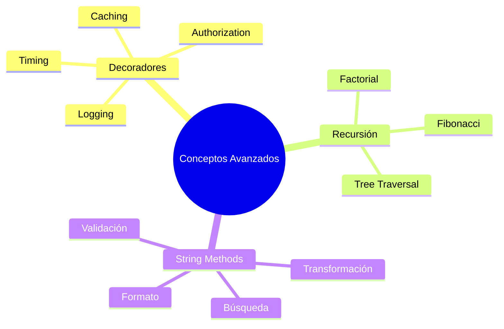
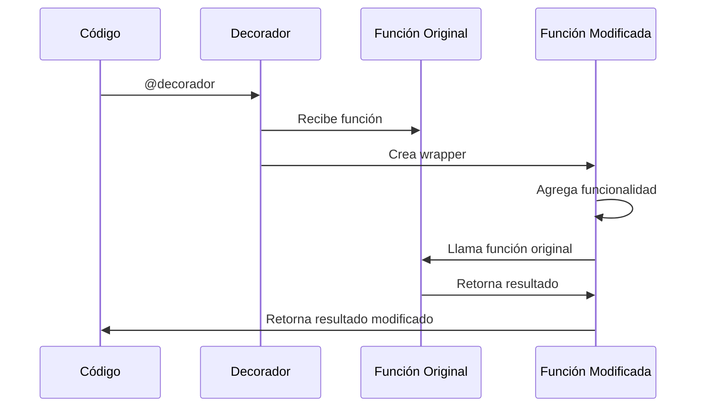

# 🚀 Conceptos Avanzados de Python

## Mapa de Conceptos Avanzados



## Decoradores

### Lección 21: Decoradores en Python

Los decoradores son funciones que modifican el comportamiento de otras funciones sin cambiar su código.

#### Diagrama: Cómo Funcionan los Decoradores



#### Flujo de Ejecución

```
Sin Decorador:
┌──────────┐
│ función  │ → Ejecuta → Resultado
└──────────┘

Con Decorador:
┌────────────────────────────────────┐
│         @decorador                 │
│  ┌──────────────────────────────┐  │
│  │  Código antes               │  │
│  │  ┌──────────┐               │  │
│  │  │ función  │ → Ejecuta     │  │
│  │  └──────────┘               │  │
│  │  Código después             │  │
│  └──────────────────────────────┘  │
└────────────────────────────────────┘
                │
                ▼
           Resultado
```

#### ¿Qué es un Decorador?

Un decorador es una función de orden superior que toma otra función como argumento y retorna una versión modificada de ella.

#### Sintaxis Básica

```python
def decorator(function):
    def funcion_modificada():
        print("Antes de ejecutar la función")
        function()
        print("Después de ejecutar la función")
    return funcion_modificada

@decorator
def saludo():
    print("Hola")

saludo()
# Antes de ejecutar la función
# Hola
# Después de ejecutar la función
```

---

### Casos de Uso Comunes

#### 1. Logging y Debugging

```python
def log_decorator(func):
    def wrapper(*args, **kwargs):
        print(f"Executing {func.__name__} with arguments {args} and {kwargs}")
        result = func(*args, **kwargs)
        print(f"{func.__name__} returned {result}")
        return result
    return wrapper

@log_decorator
def add(a, b):
    return a + b

add(3, 4)
# Executing add with arguments (3, 4) and {}
# add returned 7
```

#### 2. Medición de Performance

```python
import time

def timing_decorator(func):
    def wrapper(*args, **kwargs):
        start_time = time.time()
        result = func(*args, **kwargs)
        end_time = time.time()
        print(f"{func.__name__} took {end_time - start_time} seconds")
        return result
    return wrapper

@timing_decorator
def slow_function(delay_time):
    time.sleep(delay_time)

slow_function(2)
# slow_function took 2.0 seconds
```

#### 3. Autorización y Autenticación

```python
def admin_only(func):
    def wrapper(*args, **kwargs):
        if not user_is_admin():
            raise Exception("This function can only be used by admin users.")
        return func(*args, **kwargs)
    return wrapper

@admin_only
def sensitive_function():
    print("Sensitive data accessed.")
```

#### 4. Caching/Memoization

```python
def memoize(func):
    cache = {}
    def wrapper(*args):
        if args not in cache:
            cache[args] = func(*args)
        return cache[args]
    return wrapper

@memoize
def fibonacci(n):
    if n < 2:
        return n
    return fibonacci(n-1) + fibonacci(n-2)
```

💡 **Tip**: Los decoradores son especialmente útiles para separar concerns (logging, timing, validation) del código principal.

---

## Recursión Avanzada

### Lección 22: Técnicas Recursivas Avanzadas

La recursión es una técnica donde una función se llama a sí misma para resolver problemas complejos.

#### Factorial

```python
def factorial(n):
    if n == 1:
        return 1
    else:
        return n * factorial(n - 1)

print(factorial(5))  # 120
```

#### Fibonacci

```python
def fibonacci(n):
    if n == 0:
        return 0
    elif n == 1:
        return 1
    else:
        return fibonacci(n-1) + fibonacci(n-2)

for n in range(5):
    print(f"Term {n} = {fibonacci(n)}")
# Term 0 = 0
# Term 1 = 1
# Term 2 = 1
# Term 3 = 2
# Term 4 = 3
```

#### Tree Traversal (Recorrido de Árboles)

```python
class Node:
    def __init__(self, key):
        self.left = None
        self.right = None
        self.val = key

def inorder_traversal(root):
    if root:
        inorder_traversal(root.left)
        print(root.val)
        inorder_traversal(root.right)

# Ejemplo de árbol
#       1
#     /   \
#    2     3
#   / \
#  4   5

root = Node(1)
root.left = Node(2)
root.right = Node(3)
root.left.left = Node(4)
root.left.right = Node(5)

inorder_traversal(root)  # Output: 4 2 5 1 3
```

⚠️ **Advertencia**: 
- Siempre define un caso base para evitar recursión infinita
- La recursión puede consumir mucha memoria (stack overflow)
- Para problemas grandes, considera iteración o memoization

---

## String Methods

### Lección 23: Métodos Avanzados de Strings

Python ofrece una amplia variedad de métodos para manipular strings.

#### Métodos de Transformación

```python
# upper() - Convertir a mayúsculas
text = "hello world"
print(text.upper())  # "HELLO WORLD"

# lower() - Convertir a minúsculas
text = "Hello World"
print(text.lower())  # "hello world"

# capitalize() - Primera letra mayúscula
text = "hello world"
print(text.capitalize())  # "Hello world"

# title() - Primera letra de cada palabra
text = "hello world"
print(text.title())  # "Hello World"
```

#### Métodos de Limpieza

```python
# strip() - Remover espacios
text = "   hello world   "
print(text.strip())  # "hello world"

# lstrip() - Remover espacios izquierda
# rstrip() - Remover espacios derecha
```

#### Métodos de División y Unión

```python
# split() - Dividir en lista
text = "hello world python"
words = text.split()
print(words)  # ['hello', 'world', 'python']

# join() - Unir lista en string
words = ["hello", "world"]
text = " ".join(words)
print(text)  # "hello world"
```

#### Métodos de Búsqueda

```python
# find() - Encontrar índice
text = "hello world"
print(text.find("world"))  # 6
print(text.find("python"))  # -1 (no encontrado)

# startswith() - Verificar inicio
text = "hello world"
print(text.startswith("hello"))  # True

# endswith() - Verificar final
print(text.endswith("world"))  # True
```

#### Métodos de Validación

```python
# isdigit() - Solo dígitos
text = "12345"
print(text.isdigit())  # True

# isalpha() - Solo letras
text = "hello"
print(text.isalpha())  # True

# isspace() - Solo espacios
text = "   "
print(text.isspace())  # True

# isnumeric() - Es numérico
text = "123"
print(text.isnumeric())  # True
```

#### Método format()

```python
# Formato básico
name = "Alice"
message = "Hello, {}!".format(name)
print(message)  # "Hello, Alice!"

# Argumentos posicionales
first_name = "Alice"
last_name = "Smith"
message = "Hello, {} {}".format(first_name, last_name)
print(message)  # "Hello, Alice Smith"

# Argumentos con palabras clave
message = "Hello, {first} {last}".format(
    first="Alice", 
    last="Smith"
)
print(message)  # "Hello, Alice Smith"

# Formato de números
pi = 3.14159
message = "Pi is {:.2f}".format(pi)
print(message)  # "Pi is 3.14"

# Alineación
text = "Python"
print("|{:<10}|".format(text))  # "|Python    |" (izquierda)
print("|{:>10}|".format(text))  # "|    Python|" (derecha)
print("|{:^10}|".format(text))  # "|  Python  |" (centro)
```

---

### Ejemplos Prácticos

#### Ejemplo 1: Palíndromo

```python
def is_palindrome(input_string):
    new_string = ""
    reverse_string = ""
    
    for i in input_string:
        if i != " ":
            new_string = new_string + i
            reverse_string = i + reverse_string
    
    if new_string.lower() == reverse_string.lower():
        return True
    return False

print(is_palindrome("Never Odd or Even"))  # True
print(is_palindrome("kayak"))  # True
```

#### Ejemplo 2: Conversión de Distancia

```python
def convert_distance(miles):
    km = miles * 1.6
    result = "{miles} miles equals {km:.1f} km".format(
        miles=miles, 
        km=km
    )
    return result

print(convert_distance(12))  # "12 miles equals 19.2 km"
```

#### Ejemplo 3: Nametag

```python
def nametag(first_name, last_name):
    return "{first}, {last}.".format(
        first=first_name, 
        last=last_name[:1]
    )

print(nametag("Jane", "Smith"))  # "Jane S."
```

#### Ejemplo 4: Pig Latin

```python
def pig_latin(text):
    say = ""
    words = text.split()
    for word in words:
        say = say + word[1:] + word[0] + "ay "
    return say.strip()

print(pig_latin("hello how are you"))
# "ellohay owhay reaay ouyay"
```

---

## Resumen

En esta sección aprendiste:
- ✅ Decoradores y sus casos de uso
- ✅ Recursión avanzada con árboles
- ✅ Métodos completos de strings
- ✅ Formato avanzado con format()
- ✅ Validación y transformación de texto

💡 **Siguiente paso**: Continúa con [OOP Básico](./05-oop-basico.md) para aprender Programación Orientada a Objetos.
