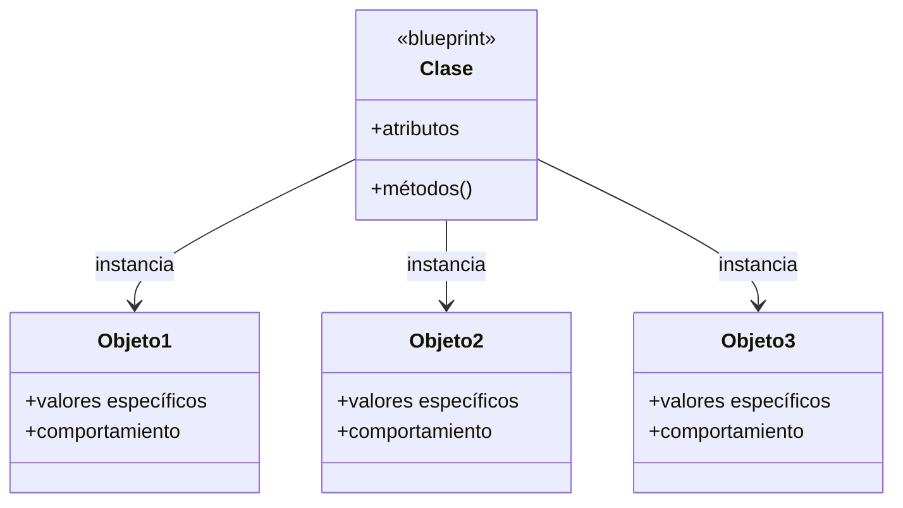
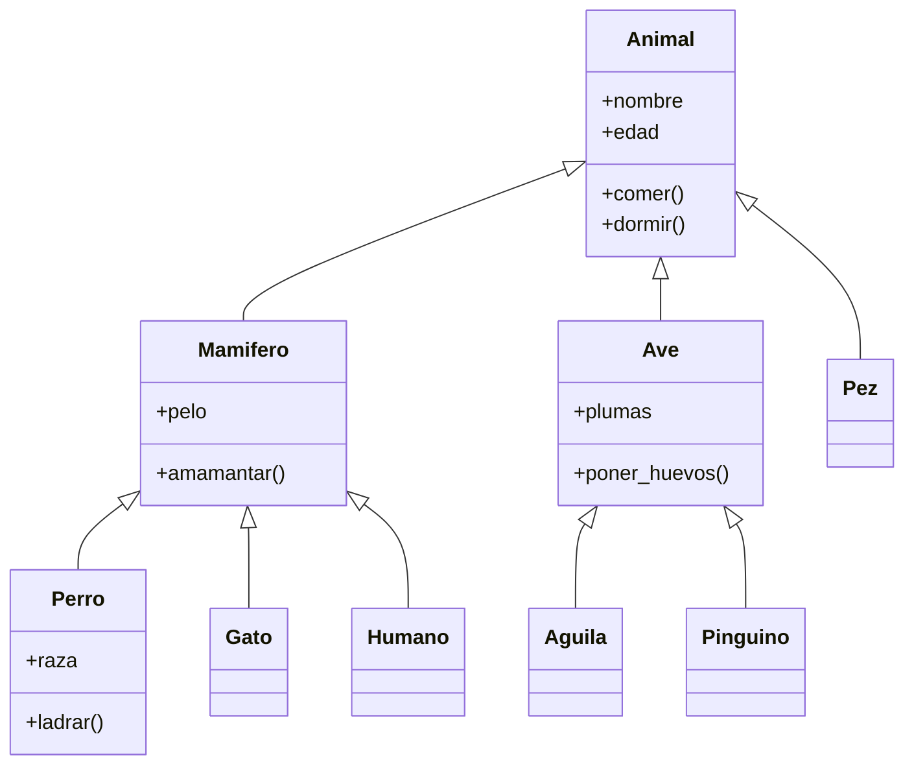

# 🏗️ Programación Orientada a Objetos - Básico

## Introducción

### Lección 25: Conceptos Fundamentales de OOP

#### Diagrama: Clase vs Objeto



#### Ejemplo Visual

```
┌─────────────────────────────────┐
│         Clase: Auto             │
│  ┌───────────────────────────┐  │
│  │ Atributos:                │  │
│  │  - marca                  │  │
│  │  - modelo                 │  │
│  │  - color                  │  │
│  │  - velocidad              │  │
│  └───────────────────────────┘  │
│  ┌───────────────────────────┐  │
│  │ Métodos:                  │  │
│  │  - acelerar()             │  │
│  │  - frenar()               │  │
│  │  - girar()                │  │
│  └───────────────────────────┘  │
└─────────────────────────────────┘
         │
         ├──────────┬──────────┐
         ▼          ▼          ▼
    ┌────────┐ ┌────────┐ ┌────────┐
    │ auto1  │ │ auto2  │ │ auto3  │
    │ Toyota │ │ Honda  │ │ Ford   │
    │ Rojo   │ │ Azul   │ │ Negro  │
    └────────┘ └────────┘ └────────┘
```

La Programación Orientada a Objetos (OOP) es un paradigma que organiza el código en objetos que contienen datos (atributos) y comportamientos (métodos).

#### Conceptos Clave

- **Clase**: Plantilla o blueprint para crear objetos
- **Objeto**: Instancia de una clase
- **Atributos**: Características del objeto
- **Métodos**: Funciones asociadas al objeto

---

### Creando tu Primera Clase

```python
class Apple:
    color = ""
    flavor = ""

# Instanciar la clase
jonagold = Apple()
jonagold.color = "red"
jonagold.flavor = "sweet"

print(jonagold.flavor)  # sweet
print(jonagold.flavor.upper())  # SWEET
```

#### Ejemplo: Flores

```python
class Flower:
    color = 'unknown'

rose = Flower()
rose.color = 'red'

violet = Flower()
violet.color = 'blue'

print("Roses are {},".format(rose.color))
print("violets are {},".format(violet.color))
```

---

### Constructor Method (__init__)

El método `__init__` es un método especial que se ejecuta automáticamente al crear un objeto.

```python
class Person:
    def __init__(self, name, age):
        self.name = name
        self.age = age
    
    def greeting(self):
        return "hi, my name is " + self.name

# Crear instancia
some_person = Person("Cristian", 25)
print(some_person.greeting())  # hi, my name is Cristian
```

💡 **Tip**: `self` es una referencia al objeto actual y debe ser el primer parámetro de todos los métodos de instancia.

---

### Método __str__

El método `__str__` define cómo se representa el objeto como string.

```python
class Apple:
    def __init__(self, color, flavor):
        self.color = color
        self.flavor = flavor
    
    def __str__(self):
        return "This apple is {} and its flavor is {}".format(
            self.color, 
            self.flavor
        )

jonagold = Apple("red", "sweet")
print(jonagold)
# This apple is red and its flavor is sweet
```

---

### Docstrings en Clases

```python
class Person:
    def __init__(self, name):
        self.name = name
    
    def greeting(self):
        """Outputs a message with the name of the person"""
        print("Hello! My name is {}.".format(self.name))

help(Person)  # Muestra la documentación
```

---

### Ejemplos Prácticos

#### Ejemplo 1: Clase City

```python
class City:
    name = ""
    country = ""
    elevation = 0
    population = 0

city1 = City()
city1.name = "Cusco"
city1.country = "Peru"
city1.elevation = 3399
city1.population = 358052

city2 = City()
city2.name = "Sofia"
city2.country = "Bulgaria"
city2.elevation = 2290
city2.population = 1241675

def max_elevation_city(min_population):
    if city1.population > min_population:
        if city1.elevation > city2.elevation:
            return "{}, {}".format(city1.name, city1.country)
    return ""

print(max_elevation_city(100000))  # Cusco, Peru
```

#### Ejemplo 2: Clase Dog

```python
class Dog:
    years = 0
    
    def dog_years(self):
        return self.years * 7

fido = Dog()
fido.years = 3
print(fido.dog_years())  # 21
```

#### Ejemplo 3: Clase Celular

```python
class Celular:
    def __init__(self, marca, modelo, camara):
        self.marca = marca
        self.modelo = modelo
        self.camara = camara
    
    def llamar(self):
        print(f'Estás haciendo una llamada desde un: {self.modelo}')
    
    def colgar(self):
        print(f'Cortaste la llamada desde un: {self.modelo}')

celular1 = Celular("Samsung", "S50", "50MP")
celular1.llamar()  # Estás haciendo una llamada desde un: S50
```

---

## Herencia

### Lección 26: Herencia en Python

La herencia permite que una clase (hija) herede atributos y métodos de otra clase (padre).

#### Diagrama de Herencia



#### Herencia Simple

```python
class Persona:
    def __init__(self, nombre, edad, nacionalidad):
        self.nombre = nombre
        self.edad = edad
        self.nacionalidad = nacionalidad
    
    def hablar(self):
        print("Hola, estoy hablando")

class Empleado(Persona):
    def __init__(self, nombre, edad, nacionalidad, trabajo, salario):
        super().__init__(nombre, edad, nacionalidad)
        self.trabajo = trabajo
        self.salario = salario

roberto = Empleado("Roberto", 43, "Argentino", "Developer", "UnMillon")
roberto.hablar()  # Hola, estoy hablando
print(roberto.nombre)  # Roberto
```

💡 **Tip**: `super()` se usa para llamar métodos de la clase padre.

---

### Herencia Múltiple

Python permite que una clase herede de múltiples clases padre.

```python
class Persona:
    def __init__(self, nombre, edad, nacionalidad):
        self.nombre = nombre
        self.edad = edad
        self.nacionalidad = nacionalidad
    
    def hablar(self):
        print("Hola, estoy hablando")

class Artista:
    def __init__(self, habilidad):
        self.habilidad = habilidad
    
    def mostrar_habilidad(self):
        print(f"Mi habilidad es: {self.habilidad}")

class EmpleadoArtista(Persona, Artista):
    def __init__(self, nombre, edad, nacionalidad, habilidad, salario, empresa):
        Persona.__init__(self, nombre, edad, nacionalidad)
        Artista.__init__(self, habilidad)
        self.salario = salario
        self.empresa = empresa
    
    def presentarse(self):
        self.mostrar_habilidad()

roberto = EmpleadoArtista(
    "Roberto", 43, "Colombiana", 
    "Cantar", 1000000, "Globant"
)
roberto.presentarse()  # Mi habilidad es: Cantar
```

---

### Verificación de Herencia

```python
# issubclass() - Verifica si una clase es subclase de otra
herencia = issubclass(EmpleadoArtista, Persona)
print(herencia)  # True

# isinstance() - Verifica si un objeto es instancia de una clase
instancia = isinstance(roberto, EmpleadoArtista)
print(instancia)  # True
```

---

### Ejemplo: Clothing

```python
class Clothing:
    material = ""
    
    def __init__(self, name):
        self.name = name
    
    def checkmaterial(self):
        print("This {} is made of {}".format(self.name, self.material))

class Shirt(Clothing):
    material = "Cotton"

polo = Shirt("Polo")
polo.checkmaterial()  # This Polo is made of Cotton
```

---

### Ejemplo: Animal Hierarchy

```python
class Animal:
    def comer(self):
        print('El animal está comiendo')

class Ave(Animal):
    def volar(self):
        print('El animal está volando')

class Mamifero(Animal):
    def amamantar(self):
        print('El animal está amamantando')

class Murcielago(Mamifero, Ave):
    pass

murcielago = Murcielago()
murcielago.comer()       # El animal está comiendo
murcielago.amamantar()   # El animal está amamantando
murcielago.volar()       # El animal está volando
```

---

### Tipos de Herencia

#### 1. Herencia Simple
Una clase hija hereda de una clase padre.

```python
class Parent:
    pass

class Child(Parent):
    pass
```

#### 2. Herencia Múltiple
Una clase hija hereda de múltiples clases padre.

```python
class Parent1:
    pass

class Parent2:
    pass

class Child(Parent1, Parent2):
    pass
```

#### 3. Herencia Multinivel
Una clase hereda de otra que a su vez hereda de otra.

```python
class Grandparent:
    pass

class Parent(Grandparent):
    pass

class Child(Parent):
    pass
```

#### 4. Herencia Jerárquica
Múltiples clases hijas heredan de una clase padre.

```python
class Parent:
    pass

class Child1(Parent):
    pass

class Child2(Parent):
    pass
```

---

## Resumen

En esta sección aprendiste:
- ✅ Crear clases y objetos
- ✅ Usar `__init__` y `__str__`
- ✅ Definir atributos y métodos
- ✅ Herencia simple y múltiple
- ✅ Usar `super()` para llamar métodos padre
- ✅ Verificar herencia con `issubclass()` e `isinstance()`

💡 **Siguiente paso**: Continúa con [OOP Avanzado](./06-oop-avanzado.md) para aprender MRO, polimorfismo y encapsulación.
