# 🎓 Programación Orientada a Objetos - Avanzado

## MRO - Method Resolution Order

### Lección 27: Orden de Resolución de Métodos

#### Diagrama de MRO

```mermaid
graph TD
    A[object] --> B[A]
    A --> C[A]
    B --> D[B]
    C --> E[C]
    D --> F[D]
    E --> F
    
    style F fill:#FFD700
    style D fill:#90EE90
    style E fill:#87CEEB
    style B fill:#FFB6C1
    style C fill:#FFB6C1
    style A fill:#DDA0DD
    
    note1[MRO de D: D → B → C → A → object]
```



El MRO (Method Resolution Order) determina el orden en que Python busca métodos en una jerarquía de herencia múltiple.

#### ¿Qué es MRO?

Python usa el algoritmo C3 linearization para determinar el orden de búsqueda de métodos, asegurando:
- Una clase siempre aparece antes que sus padres
- El orden de las clases padre se mantiene
- Los abuelos comunes se visitan después de todos sus hijos

#### Ver el MRO

```python
class A:
    pass

class B(A):
    pass

print(B.mro())
# [<class '__main__.B'>, <class '__main__.A'>, <class 'object'>]
```

---

### Herencia Múltiple y MRO

```python
class A:
    pass

class B(A):
    pass

class C(A):
    pass

class D(B, C):
    pass

print(D.mro())
# [<class '__main__.D'>, <class '__main__.B'>, 
#  <class '__main__.C'>, <class '__main__.A'>, <class 'object'>]
```

💡 **Explicación**: D busca en B antes que C, y ambos antes que A (su padre común).

---

### Ejemplo con Métodos

```python
class A:
    def hablar(self):
        print("Hola desde A")

class B(A):
    def hablar(self):
        print("Hola desde B")

class C(A):
    def hablar(self):
        print("Hola desde C")

class D(B, C):
    def hablar(self):
        print("Hola desde D")

d = D()
d.hablar()  # Hola desde D

print(D.mro())
# [<class '__main__.D'>, <class '__main__.B'>, 
#  <class '__main__.C'>, <class '__main__.A'>, <class 'object'>]
```

---

### Ejemplo: Animal Hierarchy

```python
class Animal:
    def comer(self):
        print('El animal está comiendo')

class Ave(Animal):
    def volar(self):
        print('El animal está volando')

class Mamifero(Animal):
    def amamantar(self):
        print('El animal está amamantando')

class Murcielago(Mamifero, Ave):
    pass

murcielago = Murcielago()
murcielago.comer()       # El animal está comiendo
murcielago.amamantar()   # El animal está amamantando
murcielago.volar()       # El animal está volando

print(Murcielago.mro())
# Muestra el orden de búsqueda de métodos
```

---

## Polimorfismo

### Lección 28: Polimorfismo en Python

Polimorfismo significa "muchas formas". Permite usar la misma interfaz para diferentes tipos de objetos.

#### Diagrama de Polimorfismo


#### Tipos de Polimorfismo

```
┌─────────────────────────────────────────┐
│         POLIMORFISMO EN PYTHON          │
├─────────────────────────────────────────┤
│                                         │
│  1. Duck Typing                         │
│     "Si camina como pato y grazna       │
│      como pato, entonces es un pato"    │
│                                         │
│  2. Operator Overloading                │
│     __add__, __sub__, __mul__           │
│                                         │
│  3. Method Overriding                   │
│     Redefinir métodos en subclases      │
│                                         │
└─────────────────────────────────────────┘
```

#### Tipos de Polimorfismo

1. **Duck Typing**
2. **Operator Overloading**
3. **Method Overriding**

---

### 1. Duck Typing

"Si camina como pato y grazna como pato, entonces es un pato"

```python
class Duck:
    def quack(self):
        print("Quack!")

class Dog:
    def quack(self):
        print("Woof!")

def make_it_quack(obj):
    obj.quack()

make_it_quack(Duck())  # Quack!
make_it_quack(Dog())   # Woof!
```

💡 **Tip**: Python no verifica el tipo, solo que el objeto tenga el método necesario.

---

### 2. Operator Overloading

Sobrecarga de operadores para que funcionen con objetos personalizados.

```python
class Vector:
    def __init__(self, x, y):
        self.x = x
        self.y = y
    
    def __add__(self, other):
        return Vector(self.x + other.x, self.y + other.y)
    
    def __str__(self):
        return f"Vector({self.x}, {self.y})"

v1 = Vector(2, 3)
v2 = Vector(5, -1)
v3 = v1 + v2
print(v3)  # Vector(7, 2)
```

---

### 3. Method Overriding

Las subclases pueden redefinir métodos heredados.

```python
class Animal:
    def speak(self):
        print("Generic animal sound")

class Cat(Animal):
    def speak(self):
        print("Meow!")

class Dog(Animal):
    def speak(self):
        print("Woof!")

pet1 = Cat()
pet2 = Dog()

pet1.speak()  # Meow!
pet2.speak()  # Woof!
```

---

### Dynamic Linking

Python usa enlace dinámico por defecto.

```python
import datetime

now = datetime.datetime.now()
print(now)
```

El módulo se carga en tiempo de ejecución, no se embebe en el código.

---

## Encapsulación

### Lección 29: Encapsulación en Python

La encapsulación oculta los detalles internos y restringe el acceso directo a los datos.

#### Niveles de Acceso Visual

```
┌──────────────────────────────────────────────┐
│            ENCAPSULACIÓN                     │
├──────────────────────────────────────────────┤
│                                              │
│  🌍 Público (public)                         │
│     variable                                 │
│     ✓ Accesible desde cualquier lugar       │
│                                              │
│  🔒 Protegido (protected)                    │
│     _variable                                │
│     ⚠️  Convención: uso interno              │
│                                              │
│  🔐 Privado (private)                        │
│     __variable                               │
│     ❌ Name mangling, difícil acceder        │
│                                              │
└──────────────────────────────────────────────┘
```

#### Niveles de Acceso

1. **Público**: Accesible desde cualquier lugar
2. **Protegido** (`_variable`): Convención, uso interno
3. **Privado** (`__variable`): Name mangling, difícil de acceder

---

### Miembros Privados

```python
class Car:
    def __init__(self):
        self.__make = "Toyota"    # Privado
        self.__model = "Corolla"  # Privado
    
    def get_car_details(self):
        return f"Make: {self.__make}, Model: {self.__model}"
    
    def set_car_details(self, make, model):
        self.__make = make
        self.__model = model

my_car = Car()
print(my_car.get_car_details())  # Make: Toyota, Model: Corolla

# Esto causaría error:
# print(my_car.__make)  # AttributeError

my_car.set_car_details("Honda", "Civic")
print(my_car.get_car_details())  # Make: Honda, Model: Civic
```

---

### Miembros Protegidos

```python
class Computer:
    def __init__(self):
        self._brand = "Lenovo"  # Protegido

class Laptop(Computer):
    def __init__(self):
        super().__init__()
        self._type = "ThinkPad"
    
    def get_details(self):
        return f"Brand: {self._brand}, Type: {self._type}"

my_laptop = Laptop()
print(my_laptop.get_details())  # Brand: Lenovo, Type: ThinkPad

# Posible pero no recomendado:
print(my_laptop._brand)  # Lenovo
```

---

### Decorador @property

El decorador `@property` permite acceder a métodos como si fueran atributos.

```python
class Persona:
    def __init__(self, nombre, edad):
        self.__nombre = nombre
        self.__edad = edad
    
    @property
    def nombre(self):
        return self.__nombre
    
    @nombre.setter
    def nombre(self, nombre):
        if nombre == '':
            raise ValueError('El nombre no puede estar vacío')
        self.__nombre = nombre
    
    @nombre.deleter
    def nombre(self):
        del self.__nombre

cristian = Persona('Cristian', 25)
print(cristian.nombre)  # Cristian (sin paréntesis!)

cristian.nombre = 'Cristian David'
print(cristian.nombre)  # Cristian David

del cristian.nombre
# print(cristian.nombre)  # AttributeError
```

#### Ventajas de @property

1. **Abstracción y Control**: Controla cómo se accede y modifica un atributo
2. **Atributos Calculados**: Define atributos calculados on-the-fly
3. **Código Limpio**: Hace el código más legible

---

## Abstracción

### Lección 29: Clases Abstractas

La abstracción oculta detalles complejos y muestra solo lo esencial.

#### Clase Abstracta

Una clase que no se puede instanciar directamente, sirve como plantilla.

```python
from abc import ABC, abstractmethod

class Persona(ABC):
    @abstractmethod
    def __init__(self, nombre, edad, sexo, actividad):
        self.nombre = nombre
        self.edad = edad
        self.sexo = sexo
        self.actividad = actividad
    
    @abstractmethod
    def hacer_actividad(self):
        pass
    
    def presentarse(self):
        print(f"Hola, me llamo: {self.nombre} y tengo {self.edad} años.")

class Estudiante(Persona):
    def __init__(self, nombre, edad, sexo, actividad):
        super().__init__(nombre, edad, sexo, actividad)
    
    def hacer_actividad(self):
        print(f"Estoy estudiando: {self.actividad}")

class Trabajador(Persona):
    def __init__(self, nombre, edad, sexo, actividad):
        super().__init__(nombre, edad, sexo, actividad)
    
    def hacer_actividad(self):
        print(f"Actualmente estoy en el Rubro de: {self.actividad}")

cristian = Estudiante("Cristian", 31, "Masculino", "Programador")
cristian.presentarse()      # Hola, me llamo: Cristian y tengo 31 años.
cristian.hacer_actividad()  # Estoy estudiando: Programador

# Esto causaría error:
# persona = Persona("Juan", 25, "M", "Nada")  # TypeError
```

⚠️ **Importante**: No puedes instanciar una clase abstracta directamente.

---

## Métodos Especiales

### Lección 30: Magic Methods (Dunder Methods)

Los métodos especiales permiten personalizar el comportamiento de objetos.

#### Constructor e Inicialización

```python
class MyClass:
    def __init__(self, value):
        self.value = value

obj = MyClass(42)
```

---

### Representación

#### __str__

```python
class Person:
    def __init__(self, name, age):
        self.name = name
        self.age = age
    
    def __str__(self):
        return f"{self.name} ({self.age} years old)"

person = Person("Alice", 30)
print(person)  # Alice (30 years old)
```

#### __repr__

```python
class Fraction:
    def __init__(self, numerator, denominator):
        self.numerator = numerator
        self.denominator = denominator
    
    def __repr__(self):
        return f"Fraction({self.numerator}, {self.denominator})"

frac = Fraction(3, 4)
print(repr(frac))  # Fraction(3, 4)
```

---

### Operadores Aritméticos

```python
class Vector:
    def __init__(self, x, y):
        self.x = x
        self.y = y
    
    def __add__(self, other):
        return Vector(self.x + other.x, self.y + other.y)
    
    def __sub__(self, other):
        return Vector(self.x - other.x, self.y - other.y)
    
    def __mul__(self, scalar):
        return Vector(self.x * scalar, self.y * scalar)
    
    def __str__(self):
        return f"Vector({self.x}, {self.y})"

v1 = Vector(2, 3)
v2 = Vector(5, -1)
v3 = v1 + v2
print(v3)  # Vector(7, 2)
```

---

### Operadores de Comparación

```python
class Number:
    def __init__(self, value):
        self.value = value
    
    def __eq__(self, other):
        return self.value == other.value
    
    def __lt__(self, other):
        return self.value < other.value
    
    def __gt__(self, other):
        return self.value > other.value

n1 = Number(5)
n2 = Number(10)
print(n1 < n2)   # True
print(n1 == n2)  # False
```

---

### Context Managers

```python
class FileManager:
    def __init__(self, filename, mode):
        self.filename = filename
        self.mode = mode
        self.file = None
    
    def __enter__(self):
        self.file = open(self.filename, self.mode)
        return self.file
    
    def __exit__(self, exc_type, exc_val, exc_tb):
        self.file.close()

# Uso
with FileManager('test.txt', 'w') as f:
    f.write('Hello World')
```

---

### Ejemplo Completo: Personajes

```python
class Personaje:
    def __init__(self, nombre, fuerza, velocidad):
        self.nombre = nombre
        self.fuerza = fuerza
        self.velocidad = velocidad
    
    def __repr__(self):
        return f"Nombre: {self.nombre}  Fuerza: {self.fuerza}  Velocidad: {self.velocidad}"
    
    def __add__(self, nuevo_objeto):
        nuevo_nombre = self.nombre + "-" + nuevo_objeto.nombre
        nuevo_fuerza = round(((self.fuerza + nuevo_objeto.fuerza) / 2) ** 2)
        nuevo_velocidad = round(((self.velocidad + nuevo_objeto.velocidad) / 2) ** 2)
        return Personaje(nuevo_nombre, nuevo_fuerza, nuevo_velocidad)

goku = Personaje("Goku", 100, 100)
vegeta = Personaje("Vegeta", 80, 80)
gogeta = goku + vegeta

print(gogeta)
# Nombre: Goku-Vegeta  Fuerza: 8100  Velocidad: 8100
```

---

### Métodos Especiales Comunes

| Método | Descripción |
|--------|-------------|
| `__init__` | Constructor |
| `__str__` | Representación informal (print) |
| `__repr__` | Representación oficial (debugging) |
| `__add__` | Operador + |
| `__sub__` | Operador - |
| `__mul__` | Operador * |
| `__eq__` | Operador == |
| `__lt__` | Operador < |
| `__gt__` | Operador > |
| `__len__` | Función len() |
| `__getitem__` | Indexación [] |
| `__enter__` | Context manager (with) |
| `__exit__` | Context manager cleanup |

---

## Resumen

En esta sección aprendiste:
- ✅ MRO y resolución de métodos
- ✅ Polimorfismo (duck typing, overloading, overriding)
- ✅ Encapsulación (público, protegido, privado)
- ✅ Decorador @property
- ✅ Clases abstractas con ABC
- ✅ Métodos especiales (magic methods)

💡 **Siguiente paso**: Continúa con [Principios SOLID](./07-solid.md).
